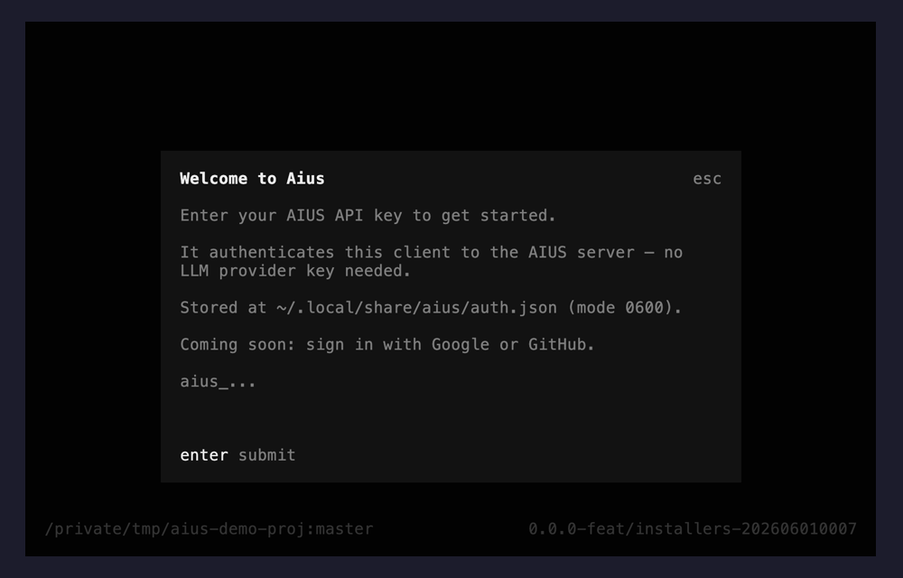

# Authentication

AIUS authenticates this client to the **AIUS server** with a single credential.
You do **not** need any LLM provider keys — the gateway holds those server-side
and routes your traffic for you.



- [Getting an account](#getting-an-account)
- [Sign-in methods](#sign-in-methods)
  - [Email + password](#1-email--password)
  - [Two-factor authentication (2FA)](#2-two-factor-authentication-2fa)
  - [Personal access token (PAT)](#3-personal-access-token-pat)
  - [Register from the CLI](#4-register-a-new-account)
- [Signing in from the TUI](#signing-in-from-the-tui)
- [Where the token is stored](#where-the-token-is-stored)
- [Managing your session](#managing-your-session)
- [How email/password login works](#how-emailpassword-login-works)
- [Pointing at a different server](#pointing-at-a-different-server)
- [Troubleshooting](#troubleshooting)

## Getting an account

Register at **[aius.co](https://aius.co)** (or run `aius auth register`). Manage
your account, clients, API keys, and 2FA from the
**[account portal](https://aius.co/account)** — see [account.md](account.md).

Once you have an account you can sign in from the CLI or the TUI in any of the
ways below.

## Sign-in methods

### 1. Email + password

The default. Sign in with your AIUS account email and password.

```sh
aius auth login                         # interactive, prompts for both
aius auth login --email you@co.com      # prompts for password (masked, no echo)
```

On success AIUS exchanges your credentials for a durable `aius_` API token and
stores **only that token** — your password is never saved.

### 2. Two-factor authentication (2FA)

If your account has 2FA enabled, after your email + password are accepted AIUS
prompts:

```
Two-factor code (or recovery code):
```

Enter either:

- the **6-digit code** from your authenticator app, or
- one of your **recovery codes** (single-use backup codes you saved when you set
  up 2FA — use one if you've lost access to your authenticator).

The same prompt accepts both. After verification AIUS mints and stores your
token as usual.

Set up 2FA and generate/regenerate recovery codes from the
[account portal](https://aius.co/account) — see
[account.md](account.md#two-factor-authentication-2fa).

### 3. Personal access token (PAT)

Create an `aius_…` token in the [account portal](https://aius.co/account) and
paste it into the first-run prompt, or sign in non-interactively:

```sh
aius auth login                    # choose paste-key, or:
aius auth login --key aius_xxx     # provide it directly
```

If the AIUS API can't be reached to verify the key, the login warns but still
saves it; pass `--force` to silence the warning.

You can also supply a key via the environment (handy for CI or scripted setups,
skips the prompt entirely):

```sh
export AIUS_API_KEY=aius_xxx
aius
```

### 4. Register a new account

Create an account without leaving the terminal:

```sh
aius auth register
aius auth register --email you@co.com --name "You"   # prompts for password
```

The password must meet the server's strength policy (the error message tells you
if it's too weak). On success you're signed in and a token is saved.

## Signing in from the TUI

You don't have to use the CLI subcommands. On first launch — and any time via
the **account menu** keybinding — the TUI offers the same choices in a dialog:

- **Log in** (email + password, with a 2FA/recovery-code step if enabled)
- **Create account** (email + password)
- **Paste API key** (an existing `aius_…` token)

Once a credential is stored, the account menu shows only **Log out**.

## Where the token is stored

On success your token is written to:

```
~/.local/share/aius/auth.json   (mode 0600)
```

This is the only place the credential lives; it is never committed or printed in
full (`aius auth status` shows a masked view).

## Managing your session

```sh
aius auth status     # show the current login and whether the token is valid
aius auth login      # sign in (email + password / 2FA, or --key for a PAT)
aius auth register   # create an account
aius auth logout     # remove the saved token from this machine
```

## How email/password login works

For the curious: the API gateway has no browser session, so login/register
returns a short-lived session token. The CLI uses it **once** to mint a durable
`aius_` API token (the same token type a PAT uses), stores only that token, and
discards the session token. 2FA-enabled accounts get a challenge instead of an
immediate session; the code (or recovery code) you enter completes the challenge
before the token is minted. This is why every sign-in method converges on the
same stored credential.

## Pointing at a different server

By default the client talks to the AIUS gateway baked into the build. To use a
different proxy (e.g. self-hosted or a dev environment), set:

```sh
export AIUS_API_URL=https://your-proxy.example.com/v1
aius
```

The URL includes the `/v1` suffix.

## Troubleshooting

- **"Cannot reach the AIUS server…"** — the gateway at the configured
  `AIUS_API_URL` isn't reachable. Check your network, or point `AIUS_API_URL`
  at a reachable proxy.
- **Token rejected / expired (401)** — run `aius auth login` again to refresh
  it, or `aius auth status` to inspect the current state.
- **"That API key was rejected by the AIUS API (401)."** — the pasted `aius_…`
  key is wrong or revoked. Create a new one in the
  [account portal](https://aius.co/account).
- **Password "too weak" on register** — choose a stronger password; the server
  enforces a minimum policy and the error states the requirement.
- **Lost authenticator** — sign in with a **recovery code** at the 2FA prompt,
  then reset 2FA from the [account portal](https://aius.co/account).

More fixes in [troubleshooting.md](troubleshooting.md).
</content>
