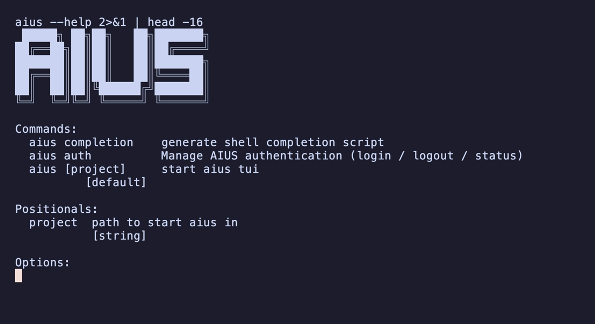

# Using AIUS

This guide covers the day-to-day workflow once AIUS is installed. For
installation see [install.md](install.md); for sign-in details see
[auth.md](auth.md); for every command and flag see [cli.md](cli.md).

- [Project layout](#project-layout)
- [Starting the agent](#starting-the-agent)
- [The interface](#the-interface)
- [Continuing and forking sessions](#continuing-and-forking-sessions)
- [Choosing a model or agent](#choosing-a-model-or-agent)
- [Resetting a project](#resetting-a-project)
- [Managing your login](#managing-your-login)
- [Upgrading](#upgrading)

## Project layout

AIUS expects two directories in the folder you run it from:

```
my-analysis/
├── context/      # your brief + any reference material the agent should read
│   └── brief.md
└── data/         # your dataset(s)
    └── customers.csv
```

- **`context/`** — drop a short brief describing the goal, plus any notes,
  schemas, or docs you want the agent to use.
- **`data/`** — drop your dataset(s) here (CSV, Parquet, etc.).

If either directory is missing, AIUS prompts you to create them before it
starts. Use `--force` to skip prompts about non-canonical files at init.

## Starting the agent

```sh
aius                 # start in the current directory
aius ./my-analysis   # start in a specific project directory
```

On the **first run in a project**, AIUS:

1. Runs a one-time local database migration (a few minutes, once per machine).
2. Sets up an isolated Python environment and installs the data-science
   libraries (via the bundled `uv`). This can take a few minutes the first
   time; subsequent runs are fast.
3. Checks the AIUS gateway is reachable (the agent loop runs server-side).
4. Opens the TUI.

Then type your request and the agent plans, writes and runs Python, inspects
the output, and iterates — reporting results inline as it goes.

## The interface



- **Type** to talk to the agent; press **Enter** to send.
- **Esc** dismisses dialogs.
- An **account menu** (keybinding) lets you log in / register / paste a key, or
  log out — the same options as `aius auth`.
- The footer shows the current project path and version.

You can also send an initial prompt without typing it in the TUI:

```sh
aius --prompt "Predict churn and explain the top drivers"
echo "summarise data/sales.csv" | aius      # piped stdin works too
```

## Continuing and forking sessions

```sh
aius --continue                 # resume the last session  (alias: -c)
aius --session ses_123          # resume a specific session (alias: -s)
aius --session ses_123 --fork   # branch off an existing session
```

`--fork` requires `--continue` or `--session`.

## Choosing a model or agent

```sh
aius --model openrouter/anthropic/claude-3.5-sonnet   # alias: -m
aius --agent <name>
```

The model is given as `provider/model`. You can also pick a model from inside
the TUI.

## Resetting a project

```sh
aius --reset
```

This rolls the project back to the AIUS baseline — moves `data/raw/*` back to
`data/`, drops generated artefacts (e.g. a generated `CONTEXT.md`), and wipes
scaffolding — then exits. **Your saved login is preserved.** It's the same
teardown the in-app resume gate uses.

## Managing your login

```sh
aius auth status     # show the current login and whether the token is valid
aius auth login      # sign in (PAT, or email + password / 2FA)
aius auth register   # create an account
aius auth logout     # remove the saved token from this machine
```

See [auth.md](auth.md) for the full authentication reference, and
[configuration.md](configuration.md) for environment variables and file paths.

## Upgrading

Re-run the installer to get the latest release:

```sh
curl -fsSL https://aius.co/install.sh | sh
```
```powershell
irm https://aius.co/install.ps1 | iex
```

Or, if you installed via npm:

```sh
npm install -g @aius-ai/cli@latest
```
</content>
